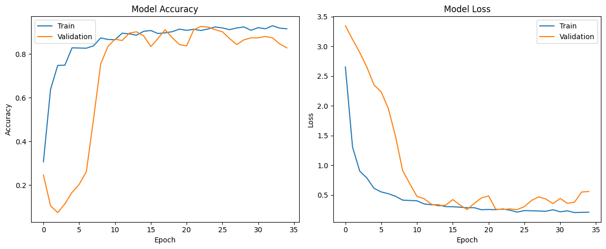

# 🖐️ Deaf and Dumb Communication Model 🗣️

This project provides a deep learning model that helps interpret sign language using MediaPipe and TensorFlow. It captures hand gestures and converts them into text, which can then be transformed into speech using gTTS (Google Text-to-Speech). 🧠💡

## 🔧 Installation

Ensure you have Python installed. Then, install the required dependencies using:

```sh
pip install --upgrade pip
pip install --upgrade mediapipe
pip install --upgrade tensorflow
pip install --upgrade scikit-learn
pip install --upgrade matplotlib
pip install gtts
pip install flask pyngrok tensorflow numpy
```

## 📂 Dataset Preparation

The model requires a dataset of hand gestures. The dataset is stored in the `data/` directory. You can collect images using OpenCV and MediaPipe for hand tracking. 🎥📸

## 📊 Model Training

1. 🏗️ The collected gesture images are preprocessed.
2. ✂️ The dataset is split into training and testing sets.
3. 🧠 A TensorFlow-based deep learning model is trained on the dataset.
4. 💾 The trained model is saved in the `models/` directory.

## ⚙️ Working of the Model

1. 📷 The camera captures hand gestures.
2. 🖐️ MediaPipe processes the hand landmarks.
3. 🤖 The deep learning model predicts the corresponding letter/word.
4. 📝 The detected text is displayed on the screen.
5. 🔊 The text is converted into speech using gTTS.

## 🔍 Basic Functionality Implementation

### 1. ✋ Hand Tracking using MediaPipe
- We use MediaPipe's Hand Tracking module to detect and track hand landmarks in real time.
- Each detected hand landmark is represented as a set of coordinates.

### 2. 🗂️ Data Collection and Preprocessing
- OpenCV captures hand images and stores them as training samples.
- The hand landmarks extracted by MediaPipe are used as features.

### 3. 🏋️ Model Training with TensorFlow
- A neural network is trained on the extracted features to classify gestures.
- The model learns to recognize different hand signs and map them to corresponding text labels.

### 4. 🔉 Text-to-Speech Conversion using gTTS
- The predicted text is passed to Google Text-to-Speech (gTTS).
- gTTS converts the text into an audio file that is played to communicate the recognized sign.

### 5. 🌍 Flask-Based Web Interface
- A simple web interface is created using Flask.
- The user can interact with the model through a webcam-based gesture recognition system.
- Ngrok is used to expose the Flask app for remote access.

## ▶️ Running the Model

To run the model, execute the following script:

```sh
python app.py
```

This will start a Flask server where you can interact with the model.

## ✨ Features
- 🖐️ Real-time hand gesture detection
- 📝 Text conversion of sign language
- 🔊 Speech output for better communication
## 🎯 Accuracy



## 🚀 Deployment
The model can be deployed using Flask and Ngrok for online access.

## 👥 Authors
- Omni
- Chitransh Kumar
- Nitesh Parihar
- Siddharth Nimbalakar
- Arpita